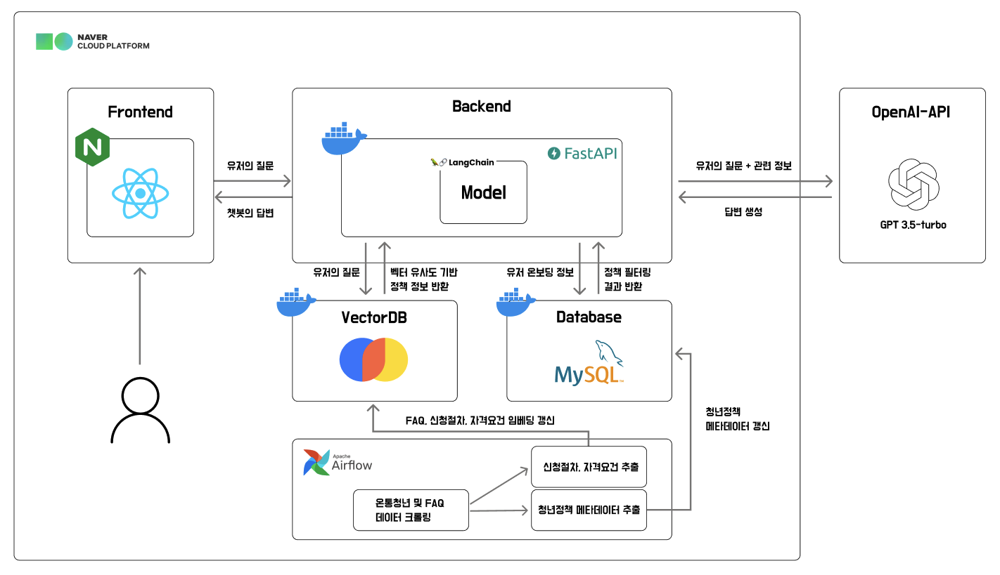

<p align="center">
  <a>
    
  </a>
</p>

<div align="center">
<h1> 길벗 Gilbert </h1> 


</div>


<!-- END doctoc generated TOC please keep comment here to allow auto update -->


<p align="center">
    
</p>

청년정책 상담 챗봇, `길벗(Gilbert)`는 청년들이 정책에 대해 쉽게 물어볼 수 있는, 말걸기 편한 AI 상담사 입니다.


## Demo

<p align="center">
    
</p>

## Features

- **24시간 문의가 가능한 실시간 챗봇**   
  <i>도메인 특화 LLM을 이용한 24시간 청년정책 온라인 창구</i>

- **열린 문의가 가능한 대화형 챗봇**  
  <i>버튼식 챗봇이 아닌 어떤 질문에도 답변이 가능한 챗봇</i>

- **개인 정보에 따른 정책 필터링**  
  <i>관심 분야, 나이, 소득에 따라 신청가능한 정책을 필터링</i>

## Service Architecture
<p align="center">
    
</p>

## Tech Stack

**RAG:** LangChain, OpenAI API  
**Client:** React  
**Server:** FastAPI, MySQL, Chroma, Docker, Airflow

## Installation

* Dependencies 
```bash
pip install -r requirements.txt
```

* nvm & npm 
```bash
curl -s -o- https://raw.githubusercontent.com/creationix/nvm/master/install.sh | bash # nvm 설치
nvm --version # 버전 확인
nvm install --lts # Node.js LTS 버전 설치
node -v # 잘 설치되었는지 확인해주세요
npm install # 이후 node_modules가 생기면 성공```
```

## Run Locally

프로젝트 Repo 복제
```bash
  git clone https://github.com/boostcampaitech6/level2-3-nlp-finalproject-nlp-03
```


프로젝트 Repo 이동
```bash
  cd level2-3-nlp-finalproject-nlp-03
```

Chatbot 실행
```bash
  cd level2-3-nlp-finalproject-nlp-03/server 
  make run
```

## Deployment

npm 실행
```bash
  cd level2-3-nlp-finalproject-nlp-03/my-app
  npm start
```

서버 실행
```bash
# 새로운 터미널을 열고 실행해 주세요!
  make run
```


## Roadmap

- **더 많은 청년 정책 지원**  
  <i>현재 6개의 정책 지원 -> 모든 청년 정책 지원을 목표!</i>

- **PDF 파일 지원**  
  <i>PDF리더 개선을 통해 현재 크롤링 기반 정보 수집의 Bias 개선!</i>

- **정책 관리 기능 추가**  
  <i>청년 정책 관리자가 FAQ를 직접 추가 가능!</i>


## Authors

<table align='center'>
  <tr>
    <td align="center">
      <br>
      <a href="https://github.com/dustnehowl">
        
      </a>    
    </td>
    <td align="center">
      <br>
      <a href="https://github.com/jingi-data">
        
      </a>    
    </td>
    <td align="center">
      <br>
      <a href="https://github.com/SeokSukyung">
        
      </a>
    </td>
    <td align="center">
      <br>
      <a href="https://github.com/Secludor">
        
      </a>
    </td>
    <td align="center">
      <br>
      <a href="https://github.com/gyunini">
        
      </a>
    </td>
    <td align="center">
      <br>
      <a href="https://github.com/Yeonseolee">
        
      </a> 
    </td>
  </tr>
</table>
